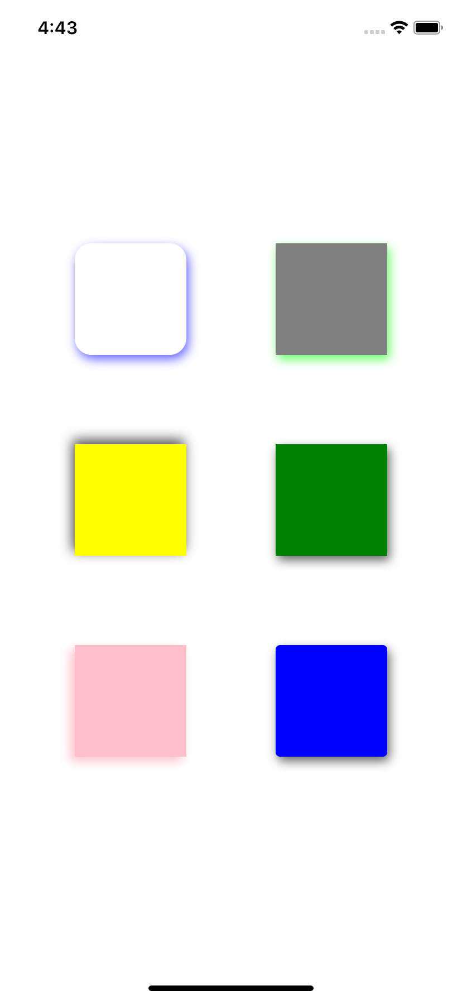
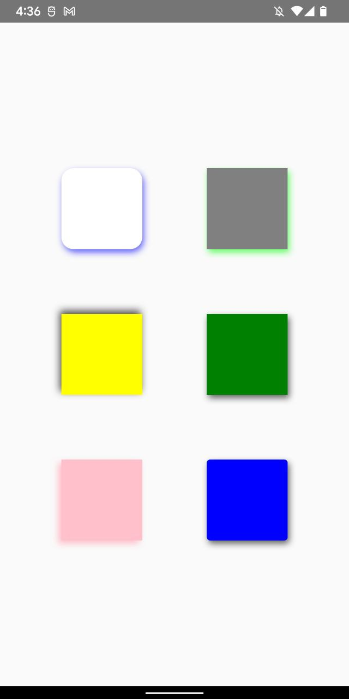

# react-native-shadow-view

<div align="center">
  <a align="center" href="https://github.com/dimaportenko?tab=followers">
    
  </a>
  <br/>
  <a align="center" href="https://twitter.com/dimaportenko">
    
  </a>
  <br/>
  <a align="center" href="https://www.youtube.com/channel/UCReKeeIMZywvQoaZPZKzQbQ">
    
  </a>
  <br/>
  <a align="center" href="https://www.youtube.com/channel/UCReKeeIMZywvQoaZPZKzQbQ">
    
  </a>
</div>
<br/>

React Native library with Android native view which supports same shadows styles as iOS. Based on the https://github.com/L-Briand/ShadowLayout. 

## Installation

```sh
npm install @dimaportenko/react-native-shadow-view
```

## Example
<table>
    <tr>
      <th style='padding-right: 30px'>
        <h1>iOS</h1>
        
      </th>
      <th>
        <h1>Android</h1>
        
      </th>
    </tr>
</table>

## Usage

```js
import * as React from 'react';

import { StyleSheet, View } from 'react-native';
import { ShadowView } from '@dimaportenko/react-native-shadow-view';

export default function App() {
  return (
    <View style={styles.container}>
      <View style={styles.row}>
        <ShadowView style={[styles.box1, styles.shadow1]}>
          <View style={styles.inner} />
        </ShadowView>
        <ShadowView style={[styles.box2, styles.shadow2]} />
      </View>
      <View style={styles.row}>
        <ShadowView style={[styles.box3, styles.shadow3]} />
        <ShadowView style={[styles.box4, styles.shadow4]} />
      </View>
      <View style={styles.row}>
        <ShadowView style={[styles.box5, styles.shadow5]} />
        <ShadowView style={[styles.box6, styles.shadow6]} />
      </View>
    </View>
  );
}

const styles = StyleSheet.create({
  container: {
    flex: 1,
    alignItems: 'center',
    justifyContent: 'center',
  },
  box1: {
    width: 100,
    height: 100,
    margin: 40,
    backgroundColor: 'white',
    borderRadius: 15,
  },
  inner: {
    width: 100,
    height: 100,
    borderRadius: 15,
  },
  box2: {
    width: 100,
    height: 100,
    margin: 40,
    backgroundColor: 'gray',
  },
  box3: {
    width: 100,
    height: 100,
    margin: 40,
    backgroundColor: 'yellow',
  },
  box4: {
    width: 100,
    height: 100,
    margin: 40,
    backgroundColor: 'green',
  },
  box5: {
    width: 100,
    height: 100,
    margin: 40,
    backgroundColor: 'pink',
  },
  box6: {
    width: 100,
    height: 100,
    margin: 40,
    backgroundColor: 'blue',
    borderRadius: 4,
  },
  shadow1: {
    shadowColor: 'blue',
    shadowOffset: {
      width: 2,
      height: 4,
    },
    shadowOpacity: 0.6,
    shadowRadius: 4.65,
  },
  shadow2: {
    shadowColor: '#0F0',
    shadowOffset: {
      width: 2,
      height: 4,
    },
    shadowOpacity: 0.6,
    shadowRadius: 4.65,
  },
  shadow3: {
    shadowColor: '#000',
    shadowOffset: {
      width: -2,
      height: -4,
    },
    shadowOpacity: 0.7,
    shadowRadius: 5.65,
  },
  shadow4: {
    shadowColor: '#000',
    shadowOffset: {
      width: 2,
      height: 4,
    },
    shadowOpacity: 0.6,
    shadowRadius: 4.65,
  },
  shadow5: {
    shadowColor: 'pink',
    shadowOffset: {
      width: -4,
      height: 4,
    },
    shadowOpacity: 1,
    shadowRadius: 4.65,
  },
  shadow6: {
    shadowColor: '#000',
    shadowOffset: {
      width: 2,
      height: 4,
    },
    shadowOpacity: 0.6,
    shadowRadius: 4.65,
  },
  row: {
    flexDirection: 'row',
  },
});

```

## Contributing

See the [contributing guide](CONTRIBUTING.md) to learn how to contribute to the repository and the development workflow.

## License

MIT
